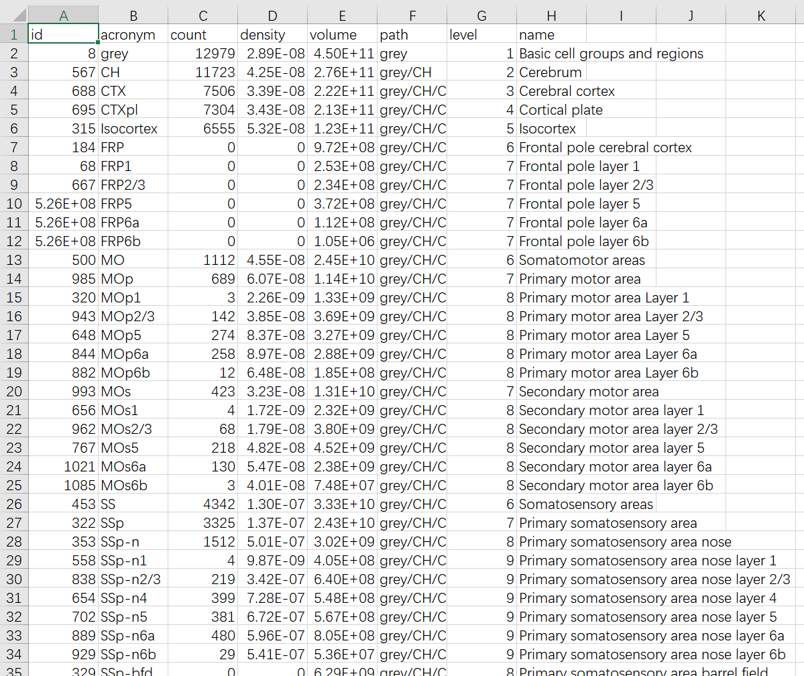

This document describes a cell identification and counting workflow based on three software tools: [freesia](https://github.com/dinglufe/freesia-atlas-cell-counting), [ilastik](https://www.ilastik.org/download.html), and [Fiji](https://imagej.net/software/fiji/).

## Image preprocessing

Export images using Fiji, with two resolutions: a high-resolution image for cell extraction and a low-resolution image for importing into freesia to match the standard brain atlas ([Allen CCFv3](https://doi.org/10.1016/j.cell.2020.04.007)).

## Cell extraction

Use ilastik to extract cells from the high-resolution image. The output is a binary image with the same size as the input image. [2019_ZMB_Ilastik.pdf](https://www.zmb.uzh.ch/dam/jcr:ba677a17-3410-45be-90ed-f305cc78457b/2019_ZMB_Ilastik.pdf) is a good tutorial for ilastik.

It is recommended to downsample the images in Fiji, for example, by a factor of 4 (ensuring the downsampled image dimensions are less than 10,000 pixels), before proceeding with this step to avoid operation lagging in ilastik.

### Label image

 | 
:---:|:---:

 | 
:---:|:---:

The selection of features is subjective and there is no fixed method. Alternatively, you can click "Suggest Features" after adding the annotation points. During training, Label 1 represents the background, while Label 2 represents the cells. Clicking "Live" allows you to view the real-time pixel classification results, indicating whether each pixel belongs to the background or the cells.

### Preview segmentation

In the bottom-left corner, the "Group Visibility" allows you to toggle the display of the segmentation results by checking or unchecking "Probability" and "Segmentation".

In the Segmentation view, cells should be separated to ensure accurate cell counting.

### Export segmentation

During export, select "Simple Segmentation" as the source. Click on "Choose Export Image Settings" and in the "Output File Info" section, select the format as TIFF. Finally, click "Export all" to initiate the export process.

The exported images can be opened and inspected using Fiji. Adjust the display range to values between 1 and 2 for proper visualization.

## Cell counting

### Generate coordinates

Step 1: Rename the exported TIFF images from the previous step to have the same name as the "low-resolution images used for brain atlas matching" (**important**).

Step 2: Open Freesia and click on the "File" menu, then select "Extract spots". Set the Voxel size, which is the ratio relative to the highest-resolution image. For example, if it is a 4-fold downsampled image, enter 4. The other parameters, Min/Max area, filter the extracted spots based on their area.

Step 3: Place the exported TIFF images in a separate folder. You can have multiple images in this folder, and they will be processed together to extract cell coordinates.

Step 4: Copy the folder path and paste it into the "Directory" field. Click "Choose". Once the software displays "Finished" in the top-right corner, two folders, "images" and "spots", will be generated in the same folder as the images. The "images" folder will contain images with crosshairs indicating the locations of the cells for inspection. The "spots" folder will contain CSV files that will be used in the subsequent steps.

 | 
:---:|:---:
| *The images in the "images" folder* | *The CSV file in the "spots" folder, where each row represents a cell.* |

### Import the "spots" folder into freesia

First, check if the CSV file in the "spots" folder has the same name as the image file that was used for brain region matching in freesia, with the addition of the ".csv" extension. For example, if the image file is named "1.tif", the corresponding CSV file should be named "1.tif.csv". If the names don't match, the import will not be successful. 

To import, click on the "File" menu and select "Import spots", then choose the generated "spots" folder.

### Export the cell counts

Click on the "File" menu and select "Export cell counting result" to export the intermediate counting result in JSON format. Choose a new folder for the export, and the JSON file will be generated in that folder. Then, click on the "File" menu again and select "Merge counting result". Choose the same folder as before, and a final counting result in CSV format will be generated in the folder. 

These two steps are separate because the final counting result often requires merging the intermediate results from multiple brain sections.

